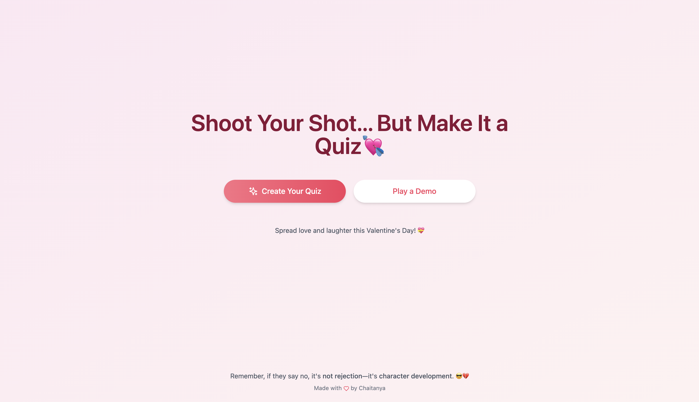

# 💘 Valentine's Quiz App 💀✨  
A fun and quirky app to shoot your shot… but with a twist—make it a quiz! This app helps you create personalized Valentine's quizzes to share with your crush and get the answer you’ve been waiting for (hopefully YES!). 🎯  

## 🛠 Features  
- **Custom Quiz Creation**: Build a customized Valentine’s Day quiz with unique questions.  
- **Play a Demo**: Try out a demo version to get a feel for how it works.  
- **Funny and Irresistible Experience**: The quiz won’t take "No" for an answer—just like you shouldn’t! 💪  

## Test
- [askmeeout.netlify.app](https://askmeeout.netlify.app/)

## 👀 Preview  
  

## 🔮 Future Features  
- **Track Submissions**: Know how many people have taken your quiz.  
- **Dynamic Yes/No Responses**: Based on quiz submissions, adjust the response style for better compatibility.  
- **Link Sharing Tracker**: Track how many people you’ve shared your quiz with and how viral it gets.  

## 🚀 Getting Started  

1. **Clone the Repository**  
   ```bash
   git clone https://github.com/yourusername/valentines-quiz-app.git
   cd valentines-quiz-app
   ```  

2. **Install Dependencies**  
   ```bash
   npm install
   ```  

3. **Run the App**  
   ```bash
   npm run dev
   ```  

4. **Access the App**  
   Open your browser at `http://localhost:5173` to see the app in action.  

## 🎨 Tech Stack  
- **React** for building the UI  
- **Vite** for a super-fast development environment  
- **React Router** for handling navigation  
- **Lucide React** for beautiful icons  
- **Tailwind CSS** for clean and responsive styling  


## ❤️ Spread the Love  
If you like this project, give it a ⭐ and share it with your friends. Let's spread some love and laughter this Valentine's Day! 💝  

---

**Made with 💀 by Chaitanya**  
